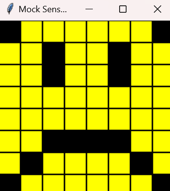

<style>

body {
    counter-reset: h2counter;
}

/* H1 - No numbering */
h1 {
    /* No counter reset or increment */
}

/* H2 - Level 1 numbering */
h2 {
    counter-reset: h3counter;
}

h2::before {
    counter-increment: h2counter;
    content: counter(h2counter) ". ";
}

/* H3 - Level 2 numbering */
h3 {
    counter-reset: h4counter;
}

h3::before {
    counter-increment: h3counter;
    content: counter(h2counter) "." counter(h3counter) " ";
}

/* H4 - Level 3 numbering (optional) */
h4 {
    counter-reset: h5counter;
}

h4::before {
    counter-increment: h4counter;
    content: counter(h2counter) "." counter(h3counter) "." counter(h4counter) " ";
}

</style>

# Evidence and Knowledge

This document includes instructions and knowledge questions that must be completed to receive a *Competent* grade on this portfolio task.

## Required evidence

### Answer all questions in this document

- Each answer should be complete, well-articulated, and within the specified word count limits (if added) for each question.
- Please make sure **all** external sources are properly cited.
- You must **use your own words**. Please include your full chat transcripts if you use generative AI in any way.
- Generative AI hallucinates, is not an authoritative source

### Make all the required modifications to the code

- Please follow the instructions in this document to make the changes needed to the code.

- When requested to upload evidence, upload all screenshots to `screenshots/` and embed them in this document. For example:

```markdown

```

- You must upload the code into your GitHub repository.
- While you can use a branch, your code should be in main when you submit.
- Upload a zip of this repository to Blackboard when you are ready to submit.
- You will be notified of your result via Blackboard
- However, if using GitHub classrooms, you may also receive additional feedback on GitHub directly

### Optional: Use of Raspberry Pi and SenseHat

Raspberry Pi or SenseHat is **optional** for this activity. You can use the included `sense_hat.py` file to simulate the SenseHat on your computer.

If you use a Pi, please **delete** the `sense_hat.py` file.

### Accessible version of the code

This project relies on visual patterns that appear on an LED matrix. If you have any accessibility requirements, you can use the `udl/accessible` branch to complete the project. This branch provides an accessible code version that uses text-based patterns instead of visual ones.

Please discuss this with your lecturer before using that branch.

## Specific Tasks & Questions

Address the following tasks and questions based on the code provided in this repository.

### Set up the project locally

1. Fork this repository (if not using GitHub Classrooms)
2. Clone your repository locally
3. Run the project locally by executing the `main.py` file
4. Evidence this by providing screenshots of the project directory structure and the output of the `main.py` file


If you are running on a Raspberry Pi, you can use the following command to run the project and then screenshot the result:

```bash
ls
python3 main.py
```

### Fundamental code comprehension

 Answer each of the following questions **as they relate to that code** supplied by in this repository (ignore `sense_hat.py`):

1. Examine the code for the `smiley.py` file and provide  an example of a variable of each of the following types and their corresponding values (`_` should be replaced with the appropriate values):

   | Type                    | name        | value                                                                                                                                                                                               |
   | ----------              |-------------|-----------------------------------------------------------------------------------------------------------------------------------------------------------------------------------------------------|
   | built-in primitive type | White       | (255, 255, 255)                                                                                                                                                                                     |
   | built-in composite type | self.pixels | [ O, Y, Y, Y, Y, Y, Y, O, Y, Y, Y, Y, Y, Y, Y, Y, Y, Y, Y, Y, Y, Y, Y, Y, Y, Y, Y, Y, Y, Y, Y, Y, Y, Y, Y, Y, Y, Y, Y, Y, Y, Y, Y, Y, Y, Y, Y, Y, Y, Y, Y, Y, Y, Y, Y, Y, O, Y, Y, Y, Y, Y, Y, O, ] |
   | user-defined type       | sense_hat   | SenseHat()                                                                                                                                                                                          |

2. Fill in (`_`) the following table based on the code in `smiley.py`:

   | Object                   | Type            |
   | ------------             |-----------------|
   | self.pixels              | List            |
   | A member of self.pixels  | Tuple           |
   | self                     | Smiley instance |

3. Examine the code for `smiley.py`, `sad.py`, and `happy.py`. Give an example of each of the following control structures using an example from **each** of these files. Include the first line and the line range:

   | Control Flow | File      | First line           | Line range |
   | ------------ |-----------|----------------------|------------|
   |  sequence    | smiley.py | self.pixels = [      | 17 ~ 26    |
   |  selection   | sad.py    | if wide_open:        | 26 ~ 29    |
   |  iteration   | happy.py  | for pixel in mouth:  | 21 ~ 22    |

4. Though everything in Python is an object, it is sometimes said to have four "primitive" types. Examining the three files `smiley.py`, `sad.py`, and `happy.py`, identify which of the following types are used in any of these files, and give an example of each (use an example from the code, if applicable, otherwise provide an example of your own):

   | Type                    | Used? | Example                              |
   | ----------------------- |-------|--------------------------------------|
   | int                     | yes   | mouth = [41, 46, 50, 51, 52, 53]     |
   | float                   | float | def blink(self, delay=0.25):         |
   | str                     | no    | _                                    |
   | bool                    | yes   | def dim_display(self, dimmed=True):  |

5. Examining `smiley.py`, provide an example of a class variable and an instance variable (attribute). Explain **why** one is defined as a class variable and the other as an instance variable.

> Your answer here
>Class variable: WHITE = (255, 255, 255)
> The variable 'white’ defines a color by its RGB values, within the Smiley class. Is considered a class variable shared across all instances of the class. 
> Instance Variable: self.pixels 
> The variable self.pixels, in the Smiley class stores color values for the 64 pixels on the 8 x 8 LED display as a default setting per object to enable unique pixel arrays, for each object instance.

6. Examine `happy.py`, and identify the constructor (initializer) for the `Happy` class:
   1. What is the purpose of a constructor (in general) and this one (in particular)?

   > Your answer here
   > In object initialization process a general constructor is employed to set up the state whereas the Happy constructor is specifically used for crafting a smiling expression. 

   2. What statement(s) does it execute (consider the `super` call), and what is the result?

   > Your answer here
   >uper().__init__() calls the constructor that initializes the object and sets up the default pixel array. 
   > self.draw_mouth() draws the mouth by changing the color of the pixels. 
   > self.draw_eyes() draws the eyes by changing the color of the pixels.

### Code style

1. What code style is used in the code? Is it likely to be the same as the code style used in the SenseHat? Give to reasons as to why/why not:
   
> Your answer here
>the code follow PEP 8 style guide.
> yes, it is likely to be the same as the code style used in the SenseHat
> Reason 1 is that the function and variable names are written in lowercase with underscores to separate words, as, per the PEP 8 style guide. 
> Reason 2 is that the code incorporates comments indicated by the symbol # to give explanations and aid in comprehending the code following the commenting format suggested by PEP 8. 

2. List three aspects of this convention you see applied in the code.

> Your answer here
>snake case(ex. def dim_display(self, dimmed=True), def draw_mouth(self))
> Consistent Indentation
> Docstring Style

3. Give two examples of organizational documentation in the code.

> Your answer here
>1. happy.py has a docstring to explain the functions and classes
> example: """
       Draws the eyes (open or closed) on the standard smiley.
        :param wide_open (bool): eyes open or closed.
        """
>2. main.py has a comment which provides overview of the module’s purpose and usage instructions.
>example: """Demonstrates the use of the Smiley class and its subclasses.
If you have access to a SenseHAT (either via a Raspberry Pi or a SenseHAT emulator), you can use the real SenseHAT class instead of the mock SenseHAT class.
That is, delete the sense_hat.py file that is included in this bundle."""

### Identifying and understanding classes

> Note: Ignore the `sense_hat.py` file when answering the questions below

1. List all the classes you identified in the project. Indicate which classes are base classes and which are subclasses. For subclasses, identify all direct base classes.
  
  Use the following table for your answers:

| Class Name | Super or Sub? | Direct parent(s)     |
|------------|---------------|----------------------|
| NotReal    | Sub           | NotRealParent        |
| smiley     | Super         | none                 |
| Happy      | Sub           | Smiley, blinkable    |
| sad        | Sub           | Smiley               |
| blinkable  | Super         | ABC, abstractmethod  |

2. Explain the concept of abstraction, giving an example from the project (note "implementing an ABC" is **not** in itself an example of abstraction). (Max 150 words)

> Your answer here
>Abstraction is used to hide background details or any unnecessary implementation about the data so that users only see the required information. 
> There are external classes being used. Such as ABC which take away from showing components that do not need to be seen or tinkered with to work. Blinkable, being an abstract class also provides a template for children classes.

3. What is the name of the process of deriving from base classes? What is its purpose in this project? (Max 150 words)

> Your answer here
> It is inheritance.In programming is when child classes inherit characteristics and functionalities from a parent class and put them to use in their way. In this project scenario we have the Happy and Sad classes getting the face design from the Smiley class and then customizing it with their expressions – a classic example of inheritance, at work. 


### Compare and contrast classes

Compare and contrast the classes Happy and Sad.

1. What is the key difference between the two classes?
   > Your answer here
   > happy class has blink method to allow the eyes to blink, otherwise, Sad class doesn't have blink method. And also happy class inherits from Smiley and Blinkable, but sad class inherits from only Smiley.
2. What are the key similarities?
   > Your answer here
   >They are both inherit from smiley. Therefore, they are subclasses, and they are using same methods such as draw_mouth and draw_eyes.
3. What difference stands out the most to you and why?
   > Your answer here
   >The most noticeable difference is that happy class has blink() method, allowing it to blink its eyes, whereas the Sad class doesn't have this method. 
4. How does this difference affect the functionality of these classes
   > Your answer here
   >The contrast influences how users perceive the classes experiences. The Happy class appears vibrant, with its eye blink animation feature that adds liveliness to it, in contrast to this lively feature of the Happy class is the absence of such animation, in the Sad class which leads to a less visually captivating encounter. 

### Where is the Sense(Hat) in the code?

1. Which class(es) utilize the functionality of the SenseHat?
   > Your answer here   
   > The class Smiley makes use of the SenseHat library functions directly via the sense_hat object while other classes, like Happy and Sad utilize the SenseHat functions indirectly by inheriting from the Smiley class and displaying on the LED matrix using the show() method. 
2. Which of these classes directly interact with the SenseHat functionalities?
   > Your answer here
   >The Smiley class works closely with the SenseHat features by wrapping the SenseHat object and employing functions such, as set_pixels and low_light to control the LED display grid. 
3. Discuss the hiding of the SenseHAT in terms of encapsulation (100-200 Words)
   > Your answer here
   >Encapsulation is a fundamental feature of object-oriented design. It refers to bundling data together with the methods that operate on the data in a single unit, a class, while restricting direct access to some of those components. For example, in the Smiley class, the SenseHat object is encapsulated by making it a private attribute through self.sense_hat. This design ensures that SenseHat functionalities, such as set_pixels or adjusting brightness, can only be accessed through controlled methods like dim_display() and show(). This will hide the details about how the SenseHat works from subclasses Happy and Sad, as well as from external code. This abstraction gives room for change or replacement of an implementation of SenseHat with minimal impact on other parts of the codebase.


### Sad Smileys Can’t Blink (Or Can They?)

Unlike the `Happy` smiley, the current implementation of the `Sad` smiley does not possess the ability to blink. Let's first explore how blinking has been implemented in the Happy Smiley by examining the blink() method, which takes one argument that determines the duration of the blink.

**Understanding Blink Mechanism:**

1. Does the code's author believe that every `Smiley` should be able to blink? Explain.

> Your answer here
>No, because the base class Smiley does not have a blink function. This means that blinking is not a behavior that every Smiley is expected to have by default.

2. For those smileys that blink, does the author expect them to blink in the same way? Explain.

> Your answer here
>No, smileys with the blinking feature must use the blinkable class, but the way they blink can be implemented differently. For example, they can have different blinking speeds. Therefore, I don't think the author expects them to blink in the same way.

3. Referring to the implementation of blink in the Happy and Sad Smiley classes, give a brief explanation of what polymorphism is.

> Your answer here
>Polymorphism is a concept whereby different classes can use the same method. Happy, for example, implements the blink method by closing and reopening its eyes. Whereas the Sad could implement the blink method by frowning. This concept of polymorphism allows us flexibility in our code by using the same method which could behave differently depending on what object it would be used with.

4. How is inheritance used in the blink method, and why is it important for polymorphism?

> Your answer here
>Inheritance allows the Happy class to reuse the show method from the Smiley base class in its blink method. This reduces duplication and centralizes shared functionality. For polymorphism, inheritance lets subclasses like Happy and Sad implement or override methods while being treated uniformly, ensuring flexibility and consistency.
1. **Implement Blink in Sad Class:**

   - Create a new method called `blink` within the Sad class. Ensure you use the same method signature as in the Happy class:

   ```python
   def blink(self, delay=0.25):
       pass  # Replace 'pass' with your implementation
   ```

2. **Code Implementation:** Implement the code that allows the Sad smiley to blink. Use the implementation from the Happy Smiley as a reference. Ensure your new method functions similarly by controlling the blink duration through the `delay` argument.

3. **Testing the Implementation:**

- Test the new blink functionality on your Raspberry Pi or within the Python classes provided. You might need to adjust the `main.py` script to incorporate Sad Smiley's new blinking capability.

Include a screenshot of the sad smiley or the modified `main.py`:



- Observe and document the Sad smiley as it blinks its eyes. Describe any adjustments or issues encountered during implementation.

  >A sad face blinked by shutting its eyes at first and then opening them back, to how they were, with no problems arising during the process. 

  ### If It Walks Like a Duck…

  Previously, you implemented the blink functionality for the Sad smiley without utilizing the class `Blinkable`. Assuming you did not use `Blinkable` (even if you actually did), consider how the Sad smiley could blink similarly to the Happy smiley without this specific class.

  1. **Class Type Analysis:** What kind of class is `Blinkable`? Inspect its superclass for clues about its classification.

     > Blinkable is an abstract class because it inherits from the Abstract Base Class (ABC) and defines the blink method.

  2. **Class Implementation:** `Blinkable` is a class intended to be implemented by other classes. What generic term describes this kind of class, which is designed for implementation by others? **Clue**: Notice the lack of any concrete implementation and the naming convention.

  >Blinkable is called an interface. Python does not have a specific "interface" keyword, but an abstract class like Blinkable achieves the same effect by declaring methods that subclasses must implement. 
  

  3. **OO Principle Identification:** Regarding your answer to question (2), which Object-Oriented (OO) principle does this represent? Choose from the following and justify your answer in 1-2 sentences: Abstraction, Polymorphism, Inheritance, Encapsulation.

  > This is Abstraction. Abstract classes like Blinkable define a blueprint or contract to be implemented by its subclasses. It lets the developer focus on high-level functionality and not specific implementation.

  4. **Implementation Flexibility:** Explain why you could grant the Sad Smiley a blinking feature similar to the Happy Smiley's implementation, even without directly using `Blinkable`.

  > The Sad smiley can be made to blink like the Happy smiley because Python is a dynamically-typed language. Because it merely checks that the Sad class implements a method called blink and then it can be treated like a "blinkable" object - no explicit inheritance from the Blinkable class is necessary or even required. Python looks for the behavior (the method name and its implementation) rather than at the interface.

  5. **Concept and Language Specificity:** In relation to your response to question (4), what is this capability known as, and why is it feasible in Python and many other dynamically typed languages but not in most statically typed programming languages like C#? **Clue** This concept is hinted at in the title of this section.

  > This feature is referred to as duck typing. In a dynamically-typed language, such as Python, an object's behavior depends on its methods and properties rather than on its explicit type or base class. Thus, any object with a blink() method can be treated as "blinkable" without needing to inherit from Blinkable. In statically-typed languages, like C#, explicit inheritance of abstract classes, or implementation of interfaces is necessary as the compiler is checking types at compile time rather than runtime.

  ***

  ## Refactoring

  ### Does a Smiley Have to Be Yellow?

  While our current implementation predominantly features yellow smileys, emotional expressions like sickness or anger typically utilize colors like green, red, or orange. We'll explore the feasibility of integrating these colors into our smileys.

  1. **Defined Colors and Their Location:**

     1. Which colors are defined and in which class(s)?
        > White, Green, Red and blank in Smiley class
     2. What type of variables hold these colors? Are the values expected to change during the program's execution? Explain your answer.
        > In the Smiley class, the colors are stored as class variables; that is, the variables are tuples representing RGB values and are declared as constants. Their value would not change during the execution of the program; hence, they provide a very consistent representation of color to all the smileys.
     3. Add the color blue to the appropriate class using the appropriate format and values.

  2. **Usage of Color Variables:**

     1. In which classes are the color variables used?
        > Happy and Sad classes

  3. **Simple Method to Change Colors:**
  4. What is the easiest way you can think to change the smileys to green? Easiest, not necessarily the best!
     > replace yellow with green in Y = self.YELLOW

  Here's a revised version of the "Flexible Colors – Step 1" section for the smiley project, incorporating your specifications for formatting and content updates:

  ### Flexible Colors – Step 1

  Changing the color of the smileys once is straightforward, but it isn't very flexible. To facilitate various colors for smileys, it is advisable not to hardcode values in any class. This approach was identified earlier as a necessary change. Let's start by removing the built-in assumptions about color in our classes.

  1. **Add a method called `complexion` to the `Smiley` class:** Implement this instance method to return `self.YELLOW`. Using the term "complexion" instead of "color" provides a more abstract terminology that focuses on the meaning rather than implementation.

  2. **Refactor subclasses to use the `complexion` method:** Modify any subclass that directly accesses the color variable to instead utilize the new `complexion` method. This ensures that color handling is centralized and can be easily modified in the future.

  3. **Determine the applicable Object-Oriented principle:** Consider whether Abstraction, Polymorphism, Inheritance, or Encapsulation best applies to the modifications made in this step.

  4. **Verify the implementation:** Ensure that the modifications function as expected. The smileys should still display in yellow, confirming that the new method correctly replaces the direct color references.

  This step is crucial for setting up a more flexible system for color management in the smiley display logic, allowing for easy adjustments and extensions in the future.

  ### Flexible Colors – Step 2

  Having removed the hardcoded color values, we now enhance the base class to support dynamic color assignments more effectively.

  1. **Modify the `__init__()` method in the `Smiley` class:** Introduce a default argument named `complexion` and assign `YELLOW` as its default value. This allows the instantiation of smileys with customizable colors.

  2. **Introduce a new instance variable:** Create a variable called `my_complexion` and assign the `complexion` parameter to it. This step ensures that each smiley instance can maintain its own color state.

  3. **Rationale for `my_complexion`:** Using a distinct instance variable like `my_complexion` avoids potential conflicts with the method parameter names and clarifies that it is an attribute specific to the object.

  4. **Bulk rename:** We want to update our grid to use the value of complexion, but we have so many `Y`'s in the grid. Use your IDE's refactoring tool to rename all instances of the **symbol** `Y` to `X`. Where `X` is the value of the `complexion` variable. Include a screenshot evidencing you have found the correct refactor tool and the changes made.

  

  5. **Update the `complexion` method:** Adjust this method to return `self.my_complexion`, ensuring that whatever color is assigned during instantiation is what the smiley displays.

  6. **Verification:** Run the updated code to confirm that Smileys still defaults to yellow unless specified otherwise.

  ### Flexible Colors – Step 3

  With the foundational changes in place, it's now possible to implement varied smiley colors for different emotional expressions.

  1. **Adjust the `Sad` class initialization:** In the `Sad` class's initializer method, change the superclass call to include the `complexion` argument with the value `self.BLUE`, as shown:

     ```python
     super().__init__(complexion=self.BLUE)
     ```

  2. **Test color functionality for the Sad smiley:** Execute the program to verify that the Sad smiley now appears blue.

  3. **Ensure the Happy smiley remains yellow:** Confirm that changes to the Sad smiley do not affect the default color of the Happy smiley, which should still display in yellow.

  4. **Design and Implement An Angry Smiley:** Create an Angry smiley class that inherits from the `Smiley` class. Set the color of the Angry smiley to red by passing `self.RED` as the `complexion` argument in the superclass call.

  ***
